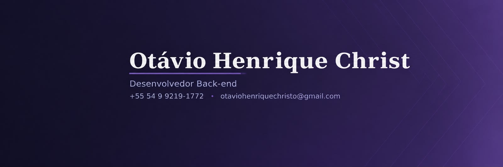

📍 Caxias do Sul - RS, Brasil &nbsp;·&nbsp;  

 

> *"Curioso por natureza, desenvolvedor por escolha."*
> *"Curious by nature, developer by choice."*

 

## Sobre mim

Sou estudante de **Ciência da Computação** na UCS e estagiário de TI na **PlenaTech**, onde lido com ambientes corporativos reais no dia a dia. Gosto de entender como as coisas funcionam por baixo do capô e de transformar lógica em soluções práticas.

🇺🇸 English version

 

I'm a **Computer Science** student at UCS and an IT intern at **PlenaTech**, where I work hands-on with real corporate environments every day. I enjoy understanding how things work under the hood and turning logic into practical solutions.

 

## Tech stack & ferramentas

**Back-end & lógica**
 

**Front-end**
 

**Ferramentas / Tools**
 

 

## Formação

- **Ciência da Computação** — Universidade de Caxias do Sul (UCS) · *em andamento*
- **Técnico em Informática** — CETEC · *concluído*

🇺🇸 English version

 

- **Computer Science** — University of Caxias do Sul (UCS) · *in progress*
- **IT Technician** — CETEC · *completed*

 

## Cursos & estudos

**Em andamento**
- Bootcamp Globant — Java & Spring Boot AI Developer *(DIO)*
- Trilha de Aprendizagem Java *(Coddy)*
- Trilha de Aprendizagem C# *(Coddy)*
- Responsive Web Design *(freeCodeCamp)*
- [POO em PHP rumo ao Adianti](https://github.com/Otaviochrist/OOP-adiant-php-) — caderno completo (classes, relações, herança, Adapter/Facade, SQL e cadastro HTML)

**Concluído**
- Python Básico *(Fundação Bradesco)*

🇺🇸 English version

 

**In progress**
- Globant Bootcamp — Java & Spring Boot AI Developer *(DIO)*
- Java Learning Path *(Coddy)*
- C# Learning Path *(Coddy)*
- Responsive Web Design *(freeCodeCamp)*
- [PHP OOP toward Adianti](https://github.com/Otaviochrist/OOP-adiant-php-) — full workbook (classes, relations, inheritance, Adapter/Facade, SQL, and HTML forms)

**Completed**
- Python Basics *(Fundação Bradesco)*

 

## Projetos em destaque

| Projeto | Descrição | Tecnologias |
|---|---|---|
| [Calculadora de Macronutrientes](https://github.com/Otaviochrist/macro-calculator) | Aplicação em console (Java) que calcula proteínas, carboidratos e gorduras com base nas metas calóricas do usuário. | `Java` |
| [Formulário de Pesquisa Web](https://github.com/Otaviochrist/survey-form) | Página responsiva construída com HTML5 e CSS3, seguindo boas práticas de semântica e acessibilidade. | `HTML5` `CSS3` |
| [POO em PHP · Adianti](https://github.com/Otaviochrist/OOP-adiant-php-) | Caderno de estudos de POO em PHP (do `new` ao módulo 3: HTML + Postgres), preparação para o Adianti Framework. | `PHP` `SQL` `HTML` `CSS` |

🇺🇸 English version

 

| Project | Description | Tech |
|---|---|---|
| [Macronutrient Calculator](https://github.com/Otaviochrist/macro-calculator) | Java console application that calculates protein, carbs, and fat based on the user's calorie goals. | `Java` |
| [Web Survey Form](https://github.com/Otaviochrist/survey-form) | Responsive page built with HTML5 & CSS3, following semantic and accessibility best practices. | `HTML5` `CSS3` |
| [PHP OOP · Adianti](https://github.com/Otaviochrist/OOP-adiant-php-) | PHP OOP workbook (from `new` to module 3: HTML + Postgres), preparation for the Adianti Framework. | `PHP` `SQL` `HTML` `CSS` |

 

---

⭐ Obrigado pela visita! Fique à vontade para explorar meus repositórios.
 
Thanks for stopping by! Feel free to explore my repositories.

